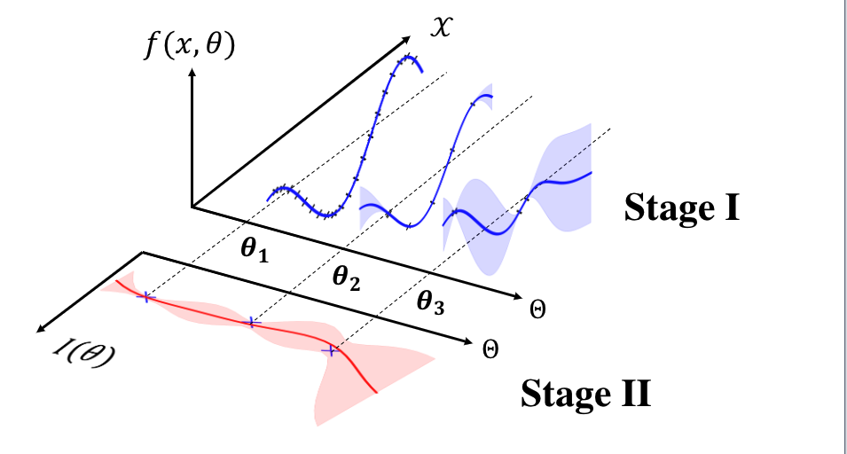

# Conditional Bayesian Quadrature

This repository contains the implementation of the code for the paper "Conditional Bayesian Quadrature". In the code, the algorithm proposed in the paper is "CBQ", the baseline methods are Least-square Monte Carlo (LSMC), Kernel Mean Shrinkage estimator (KMS), and Importance Sampling (IS).

Our approach consists in a two-stage Gaussian process regression.

## Installation

To install the necessary requirements, use the following command:

`pip install -r requirements.txt`

## Reproducing Results

### 1. Bayesian Sensitivity Analysis for Linear Model

To reproduce the results for Bayesian sensitivity analysis (Figure 2 (Left & Middle)), run the following command:

`python bayes_sensitivity.py --dim 2 --kernel_x rbf --kernel_theta matern`

You can vary the dimension by altering the argument 'dim --2' to reproduce Figure 2 (Right).

### 2. Bayesian Sensitivity Analysis for the Susceptible-Infec-tious-Recovered (SIR) Model.

To reproduce the results for the SIR model (Figure 4 (Middle)), run:

`python SIR.py`

### 3. Option Pricing in Mathematical Finance.

To reproduce the results for the Black-Scholes model using Stein kernels (Figure 4 (Left)), run:

`python black_scholes.py --kernel_theta rbf --kernel_x stein_matern`

And to reproduce the results for the Black-Scholes model not using Stein kernels (Figure 4 (Left)), run:

`python black_scholes.py --kernel_theta rbf --kernel_x log_normal_rbf`

### 4. Uncertainty Decision Making in Health Economics

To reproduce the results for uncertainty decision making in health economics (Figure 5), run:

`python health_economics.py`
